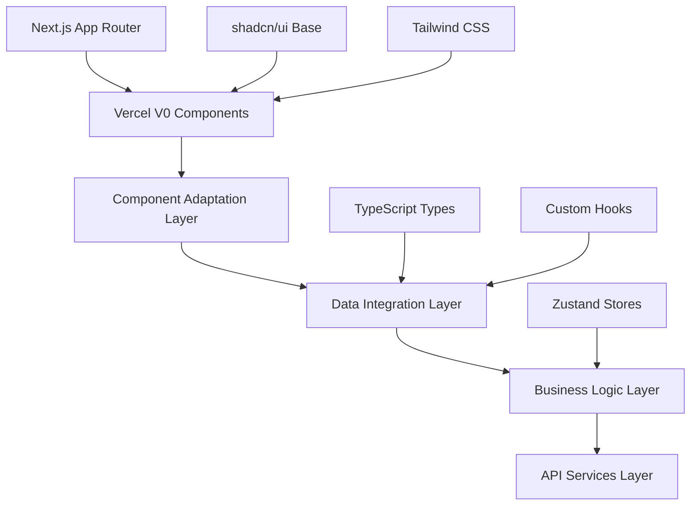

# Design Document

## Overview

The Vercel UI Integration feature involves systematically importing, configuring, and integrating Vercel V0 generated UI components into our existing Next.js budgeting application architecture. This design focuses on creating a seamless integration that maintains our established patterns while leveraging the modern, professional UI components generated by Vercel V0. The integration will result in a fully functional development environment where users can run `npm run dev` and immediately access all budgeting features with a polished, desktop-optimized interface.

## Steering Document Alignment

### Technical Standards (tech.md)
The design follows our established Next.js 14 + TypeScript + Tailwind CSS + shadcn/ui tech stack. All Vercel V0 components will be adapted to use our exact dependency versions, maintain TypeScript strict mode compliance, and follow our performance requirements (< 2 second load time, < 500KB bundle size). The integration will leverage our existing build system (Next.js with Turbopack) and package management (pnpm) while ensuring all components meet our security and accessibility standards (WCAG 2.1 AA compliance).

### Project Structure (structure.md)
The implementation will strictly follow our established directory organization with Vercel V0 components placed in appropriate locations: pages in `app/`, reusable components in `components/`, utilities in `lib/`, and custom hooks in `hooks/`. All files will follow our naming conventions (PascalCase for components, camelCase for utilities) and import patterns using `@/` aliases. The integration will maintain our modular design principles with clear separation between UI components, business logic, and data services.

## Code Reuse Analysis

### Existing Components to Leverage
- **Vercel V0 Generated Components**: All UI components from the Vercel V0 generation will be imported and adapted
- **shadcn/ui Base Components**: Leverage existing shadcn/ui component library for consistent design system
- **Next.js App Router**: Use existing Next.js 14 App Router structure for page routing and layouts
- **Tailwind CSS Configuration**: Extend existing Tailwind configuration for consistent styling
- **TypeScript Type Definitions**: Integrate with our established type system for data models

### Integration Points
- **Project Structure**: Vercel V0 components will be organized according to our structure.md specifications
- **Data Models**: Components will be adapted to use our Transaction, BudgetCategory, and SavingsGoal interfaces
- **State Management**: Integration with our planned Zustand stores and React Query for data fetching
- **API Services**: Components will be prepared for integration with our exchange rate and bank integration services
- **Theme System**: Vercel components will be adapted to use our dark theme and color scheme

## Architecture

The Vercel UI Integration follows a layered architecture that separates UI components from business logic while maintaining clean integration points for future backend services.

### Modular Design Principles
- **Single File Responsibility**: Each Vercel V0 component will be placed in its own file with a single, well-defined purpose
- **Component Isolation**: Vercel components will be isolated and reusable across different pages without tight coupling
- **Service Layer Separation**: UI components will be separated from data fetching and business logic through custom hooks
- **Utility Modularity**: Vercel components will use our established utility functions for currency conversion, date formatting, and validation



## Components and Interfaces

### Project Setup Component
- **Purpose:** Initialize Next.js project with Vercel V0 code and configure development environment
- **Interfaces:** 
  - `setupProject()`: Main setup function that imports and configures all Vercel components
  - `configureDependencies()`: Resolve dependency conflicts and install required packages
  - `setupTypeScript()`: Configure TypeScript with proper paths and strict mode
- **Dependencies:** Node.js, pnpm, Next.js 14, TypeScript 5.0+
- **Reuses:** Existing package.json, tsconfig.json, and Next.js configuration

### Component Adaptation Layer
- **Purpose:** Adapt Vercel V0 components to match our architecture and data models
- **Interfaces:**
  - `adaptComponent(component, dataModel)`: Adapts Vercel component to use our data interfaces
  - `updateProps(component, propsInterface)`: Updates component props to match our patterns
  - `integrateStyling(component, theme)`: Applies our dark theme and color scheme
- **Dependencies:** Vercel V0 components, our TypeScript types, Tailwind CSS
- **Reuses:** Our established component patterns and styling system

### Data Integration Layer
- **Purpose:** Connect Vercel components with our data models and business logic
- **Interfaces:**
  - `createMockData()`: Generates realistic financial data for testing
  - `setupDataHooks()`: Creates custom hooks for data fetching and state management
  - `configureValidation()`: Sets up Zod schemas for form validation
- **Dependencies:** Our data models, React hooks, Zod validation
- **Reuses:** Existing type definitions and validation patterns

### Navigation Integration
- **Purpose:** Integrate Vercel V0 navigation components with Next.js routing
- **Interfaces:**
  - `setupNavigation()`: Configures main navigation with all required pages
  - `createPageRoutes()`: Sets up Next.js App Router pages for each section
  - `handleRouting()`: Manages client-side navigation and state
- **Dependencies:** Next.js App Router, Vercel navigation components
- **Reuses:** Our established routing patterns and page structure

## Data Models

### VercelComponentConfig
```
interface VercelComponentConfig {
  name: string
  path: string
  type: 'page' | 'component' | 'layout' | 'utility'
  dependencies: string[]
  props: ComponentProps
  dataModel: string
  styling: StylingConfig
}
```

### ComponentAdaptation
```
interface ComponentAdaptation {
  originalComponent: React.ComponentType
  adaptedComponent: React.ComponentType
  dataInterface: string
  eventHandlers: EventHandler[]
  validationSchema: ZodSchema
  stylingOverrides: CSSProperties
}
```

### IntegrationStatus
```
interface IntegrationStatus {
  component: string
  status: 'pending' | 'adapted' | 'integrated' | 'tested'
  dependencies: string[]
  errors: string[]
  warnings: string[]
  lastUpdated: Date
}
```

## Error Handling

### Error Scenarios
1. **Dependency Conflicts**: When Vercel V0 dependencies conflict with our tech stack
   - **Handling:** Use pnpm resolution to force compatible versions, update package.json with exact versions
   - **User Impact:** Clear error messages in terminal, automatic resolution suggestions

2. **TypeScript Compilation Errors**: When Vercel components don't match our TypeScript configuration
   - **Handling:** Create type adapters, update component props interfaces, add missing type definitions
   - **User Impact:** Build process continues with warnings, components work with proper typing

3. **Component Integration Failures**: When Vercel components can't be adapted to our data models
   - **Handling:** Create wrapper components, implement data transformation layers, provide fallback components
   - **User Impact:** Components display with mock data, graceful degradation with error boundaries

4. **Styling Inconsistencies**: When Vercel components don't match our design system
   - **Handling:** Override CSS classes, update Tailwind configuration, create component variants
   - **User Impact:** Consistent visual appearance across all components

5. **Development Server Issues**: When `npm run dev` fails to start or has runtime errors
   - **Handling:** Check dependency versions, fix import paths, resolve configuration conflicts
   - **User Impact:** Clear error messages with resolution steps, working development environment

## Testing Strategy

### Unit Testing
- **Component Testing**: Test each adapted Vercel component in isolation with mocked data
- **Integration Testing**: Test component integration with our data models and business logic
- **Type Testing**: Verify TypeScript compilation and type safety across all components
- **Key Components to Test**: All Vercel V0 components, adaptation layer, data integration hooks

### Integration Testing
- **Page Integration**: Test complete page functionality with all components working together
- **Navigation Testing**: Test routing between pages and navigation state management
- **Data Flow Testing**: Test data flow from components through hooks to business logic
- **Key Flows to Test**: Dashboard loading, form submissions, navigation, component interactions

### End-to-End Testing
- **Development Environment**: Test complete `npm run dev` workflow from start to finish
- **User Journey Testing**: Test complete user workflows through all application features
- **Cross-browser Testing**: Test application functionality across different browsers
- **User Scenarios to Test**: 
  - Developer setting up the project for the first time
  - User navigating through all budgeting features
  - Form interactions and data validation
  - Responsive design on different screen sizes